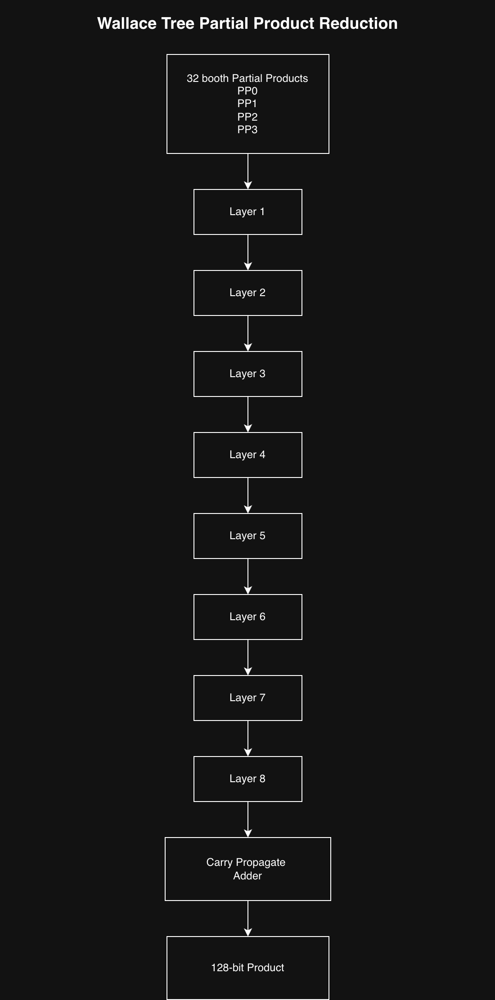
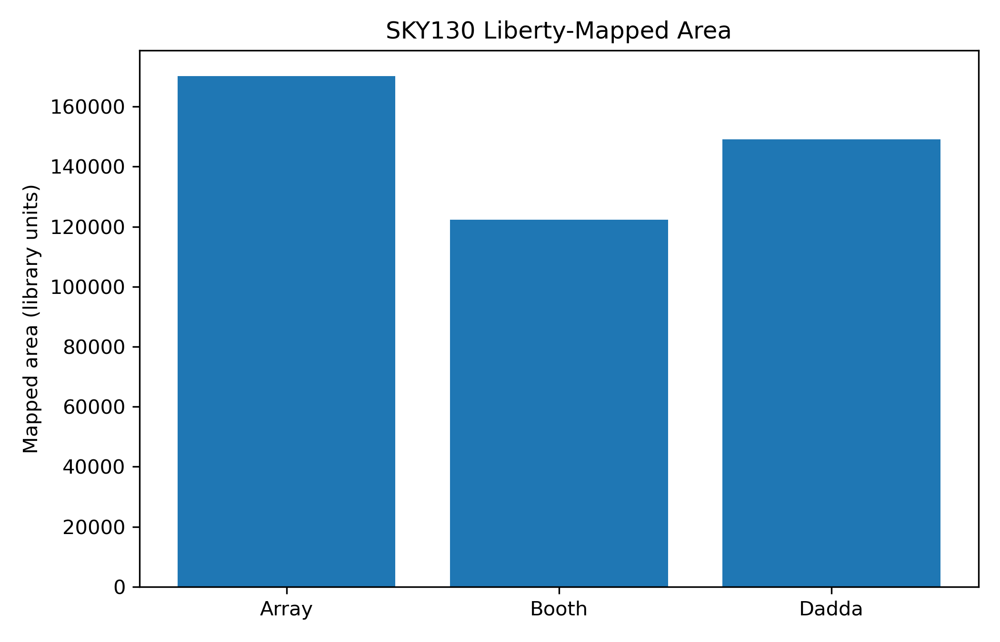
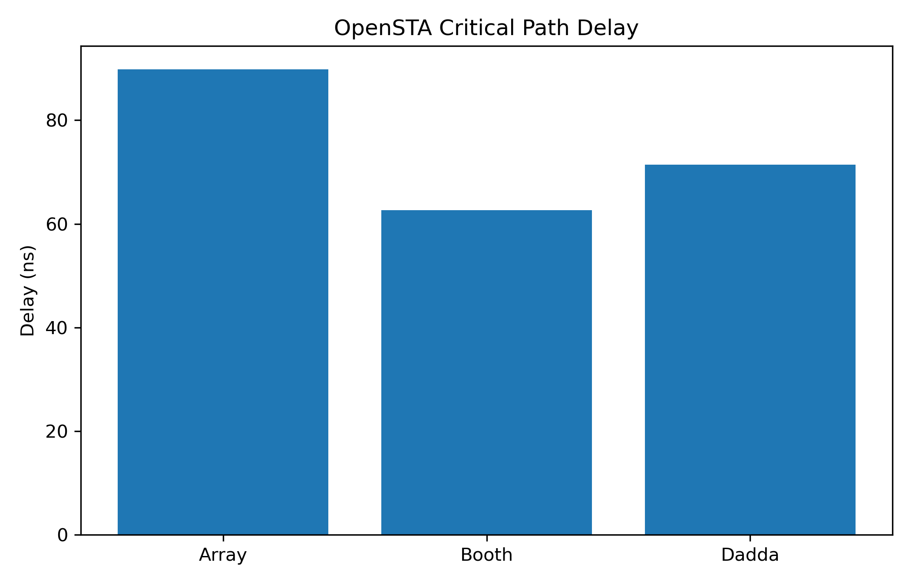
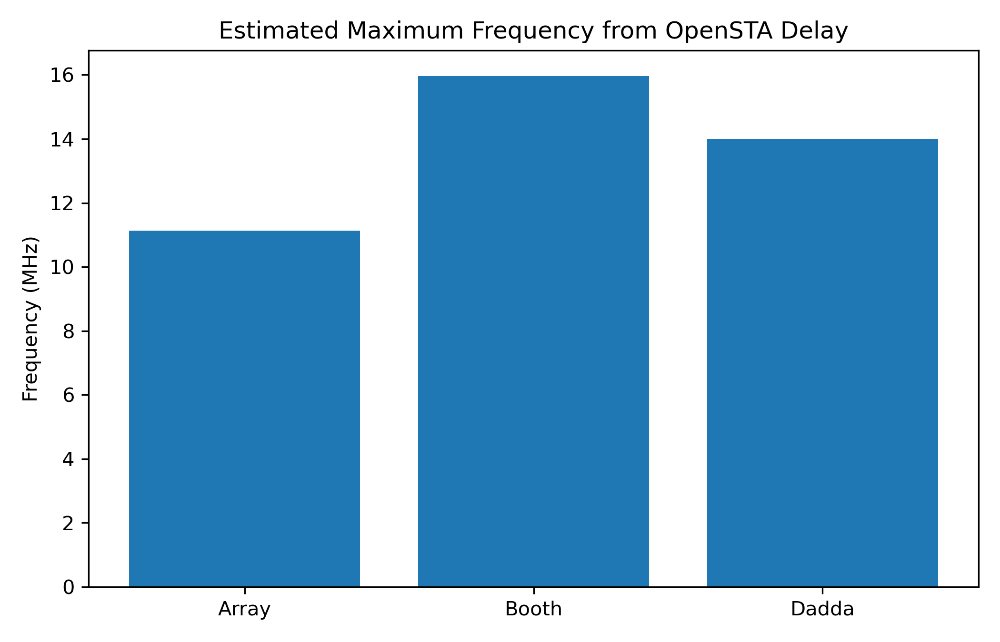
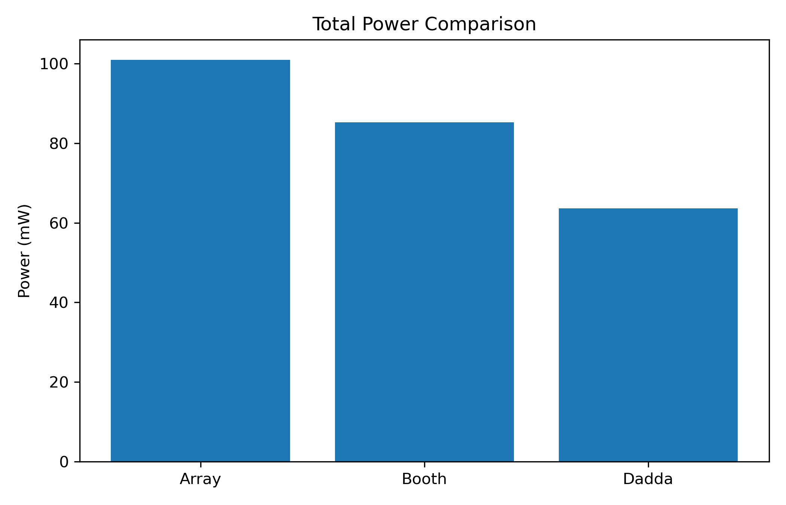
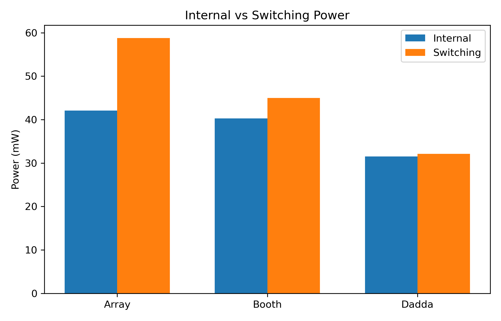
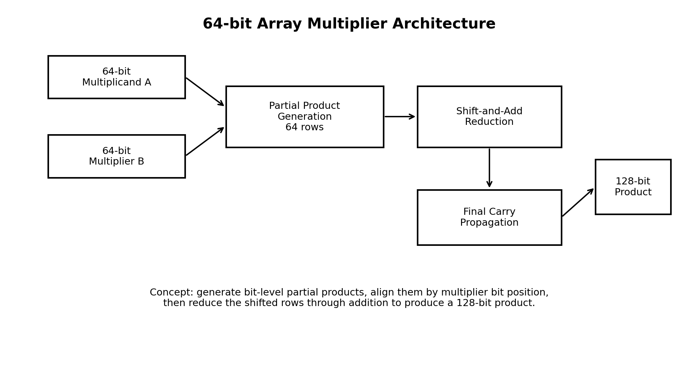
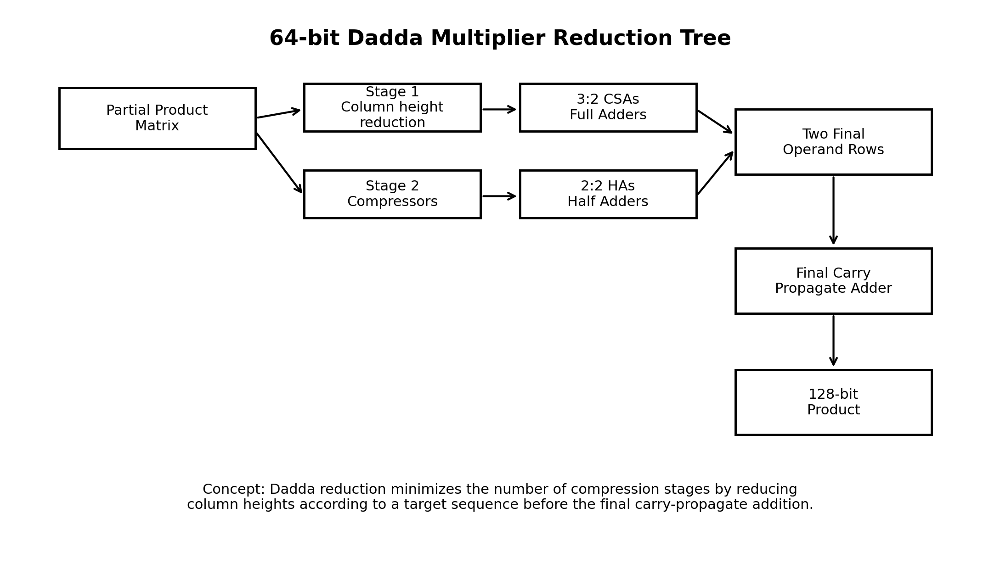

# Comparative Analysis of 64-bit Multiplier Architectures using SKY130 Open-Source ASIC Flow

This repository presents a comparative analysis of three 64-bit multiplier architectures: Array, Radix-4 Booth, and Dadda. Each design was implemented in SystemVerilog, verified through simulation, synthesized using an open-source ASIC flow, and evaluated for area, timing, speed, and activity-based power.

## Implemented Architectures

- Array Multiplier
- Radix-4 Booth Multiplier
- Dadda Multiplier

## Toolchain

- SystemVerilog
- Icarus Verilog
- Yosys
- ABC
- OpenSTA
- OpenROAD
- SKY130 HD standard-cell library
- macOS Terminal
- Ubuntu Linux
- AWS EC2 for OpenROAD execution

## Methodology

Each multiplier architecture was implemented and verified independently. RTL synthesis was performed using Yosys with the SKY130 HD standard-cell Liberty file. Timing analysis was performed using a 10 ns virtual clock constraint. Gate-level switching activity was generated from post-synthesis netlist simulation, and activity-based power estimation was performed in OpenROAD using SKY130 HD LEF and Liberty files.

The same verification approach and comparable stimulus conditions were used across all three architectures to ensure a fair comparison.

## Architecture Diagrams

### Booth Architecture


### Booth Encoding Process


### Wallace Tree Reduction



### Pipeline Timing


### Verification Flow


## Verification Summary

| Architecture | Directed Tests | Randomized Tests | Reference Model Comparison | Gate-level VCD Generated | Status |
|---|---:|---:|---|---|---|
| Array | Passed | Passed | Yes | Yes | Verified |
| Radix-4 Booth | Passed | Passed | Yes | Yes | Verified |
| Dadda | Passed | Passed | Yes | Yes | Verified |

## Final PPA Comparison

| Architecture | Cell Count | Area | Critical Path Delay | Fmax | Slack @ 10 ns | Internal Power | Switching Power | Leakage Power | Total Power |
|---|---:|---:|---:|---:|---:|---:|---:|---:|---:|
| Array | 58,143 | 281,337.32 | 82.41 ns | 12.13 MHz | -72.41 ns | 42.1 mW | 58.8 mW | 0.000125 mW | 101.0 mW |
| Radix-4 Booth | 37,939 | 195,945.43 | 15.91 ns | 62.85 MHz | -5.91 ns | 40.3 mW | 45.0 mW | 0.0000836 mW | 85.3 mW |
| Dadda | 38,802 | 211,853.18 | 6.66 ns | 150.15 MHz | +3.34 ns | 31.5 mW | 32.1 mW | 0.0000976 mW | 63.6 mW |

## Result Graphs

### Area Comparison



### Critical Path Delay Comparison



### Maximum Frequency Comparison



### Total Power Comparison



### Internal vs Switching Power



## Key Observations

- The Array multiplier had the largest area, longest delay, and highest total power.
- The Radix-4 Booth multiplier achieved the lowest area due to reduced partial product generation.
- The Dadda multiplier achieved the best timing performance, highest Fmax, positive slack, and lowest total activity-based power.

## Conclusion

The Dadda multiplier achieved the strongest overall power-performance-area trade-off among the evaluated architectures. Although the Booth multiplier used the lowest cell area, the Dadda multiplier achieved the shortest critical path delay, highest Fmax, positive timing slack at a 10 ns constraint, and the lowest activity-based power. The Array multiplier was structurally simple but showed the largest area, longest delay, and highest power consumption.

## Additional Architecture Diagrams

### Array Multiplier Architecture



### Dadda Reduction Tree



## Repository Organization

```text
designs/
  array/
  booth/
  dadda/

results/
  synthesis/
  timing/
  power/
  verification/
  vcd/

figures/
scripts/
diagrams/
recovered_root_files/
```

## Reproducibility

The repository includes RTL source files, testbenches, Yosys synthesis scripts, STA scripts, OpenROAD power analysis scripts, verification summaries, synthesis reports, timing reports, power reports, result graphs, waveform evidence, and final comparison tables.

Large generated files and full SKY130 PDK directories are excluded from the repository to keep the project lightweight. Users must provide the required SKY130 Liberty and LEF files locally when reproducing synthesis, timing, and power analysis.

## Limitations

The reported power values are activity-dependent and based on the supplied simulation stimulus. The analysis is pre-layout and does not include final routed parasitics. Therefore, the results should be interpreted as comparative open-source ASIC flow estimates rather than final silicon signoff results.
