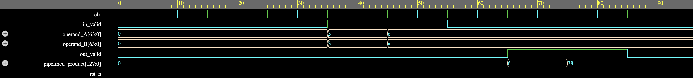

# 64-bit Pipelined Booth Multiplier

Implementation of a 64-bit Booth multiplier using structural SystemVerilog. 

## Project Scope
The design utilizes Radix-4 Booth encoding to generate partial products, structured into a multi-stage pipeline to improve throughput.

## Verification
- **Toolchain:** Icarus Verilog.
- **Methodology:** Testbench verification against known product vectors (e.g., 15 and 120).
- **Waveforms:** 

## Synthesis Metrics (Yosys)
The RTL was synthesized using Yosys. Optimization passes effectively reduced the netlist complexity:
- **Redundant Logic:** 14 cells removed.
- **Dead Connectivity:** 570 unused wires stripped.

## Design Notes
- Design targets structural modularity for easy integration into larger arithmetic logic units (ALU).
- Synthesis confirms the design maps to a standard cell library without inferred latches.
